Parts Implemented by Mustafa Furkan Suve
========================================
Homepage
^^^^^^^^

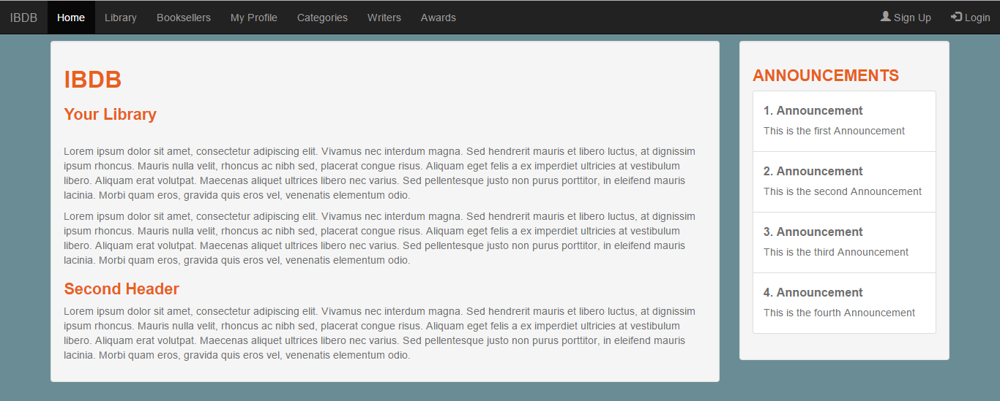

	This is the page I created using the layout. This is the homepage. There are the announcements 
	on the right taken from the Announcements table that I created.

User Area
^^^^^^^^

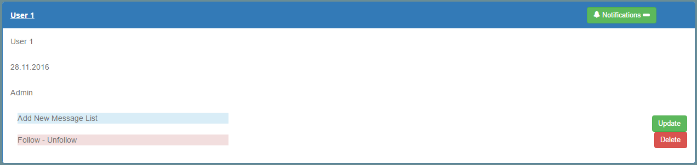

	After adding a user from the signup page, the area shown above can be opened by clicking 
	the users name. Users can add Message Lists by clicking The "Add New Message List" button.
	Users can also follow or unfollow other users by clicking the "Follow-Unfollow" button.

Message List and Messages
^^^^^^^^^^^^^^^^^^^^^^^^^

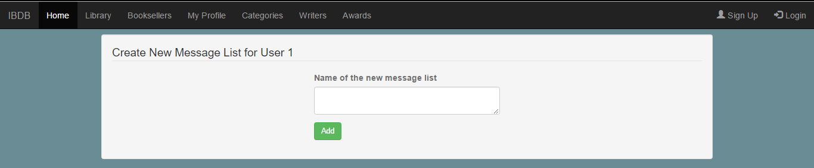

	After clicking "Add New Message" button, this page comes. User gives the name of the 
	Message List and clicks Add. Then the page shown below comes.

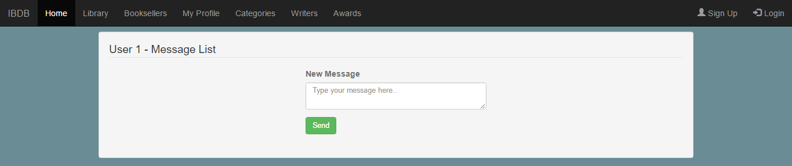
    

	This is the Message Board for the Message List that the user has just created. User can 
	enter new messages here.

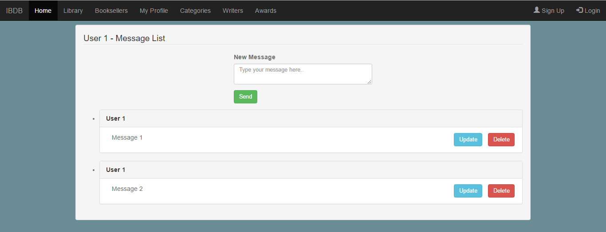

	This is how the Message Board looks when the user adds new messages. User can change the 
	content of a message by clicking the "Update" button next to it. User can also delete a 
	message by clicking the "Delete" button next to it.

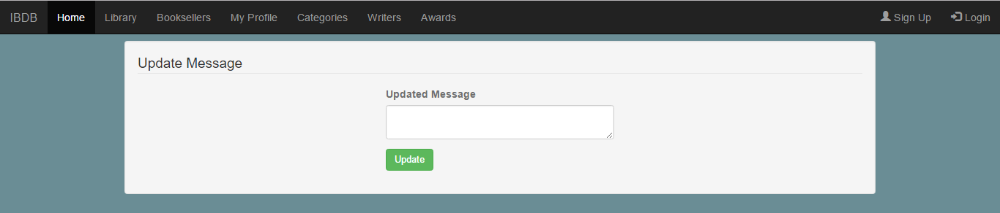

	This is the page when the user click the "Update" button next to a message. Users can enter 
	the new content of the message here. Then click "Update" to update the content of the message.

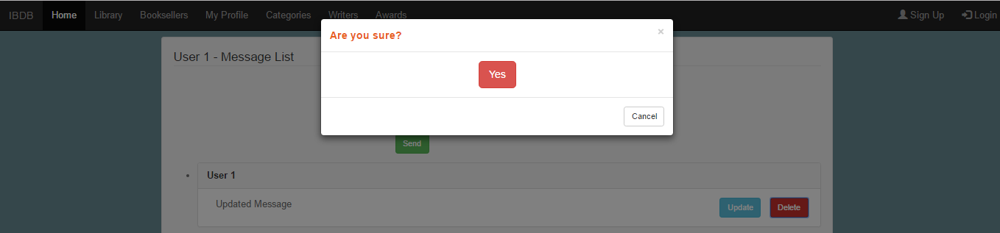

	This is the pop-up window comes when the user tries to delete a mesage. If the user clicks 
	"Yes" button, the message will be deleted, otherwise it will not.

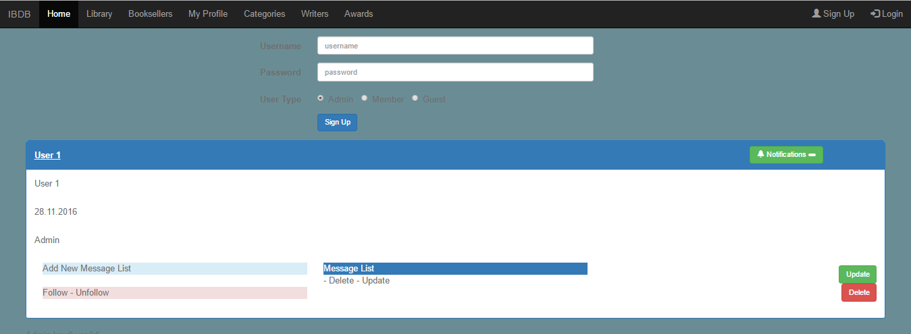

	This is how the area of a user looks when he adds a new Message List. All of his Message Lists 
	will be listed in the middle. User can access any of the Message Lists by clicking the button 
	that contains the name of the list.
	Users can also delete a Message List by clicking the text "-Delete" under it. It will delete 
	the Message List with the messages in it from the database.
	Message Lists' names can be changed as well by clicking the text "-Update" under it.

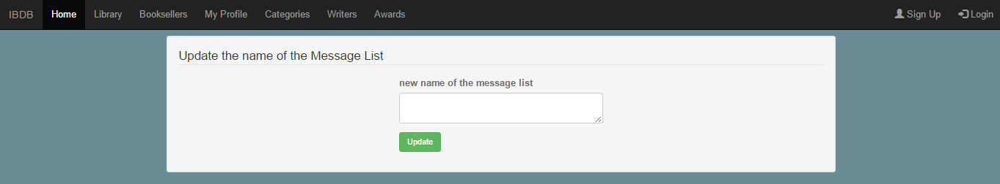

	When the user clicks "-Update", this page comes. User can enter a new name for the Message List 
	and click "Update" button to apply the changes.

Following and Unfollowing
^^^^^^^^^^^^^^^^^^^^^^^^^

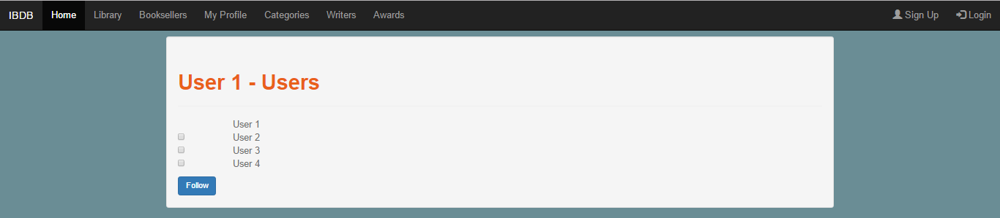

	In the signup page, when the user clicks "Follow-Unfollow" button in his area, this page comes. 
	User clicks the chechbox that is next to the users that he wants to follow, then click "Follow" button.

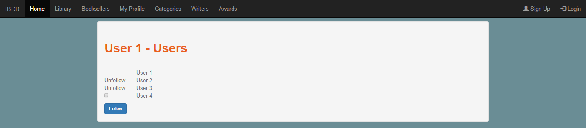

	For example, if User1 follows User2 and User3, the text "Unfollow" appears next to them for User1 to be able to unfollow them. If the user unfollows another user, then the checkbox comes again instead of "Unfollow" text.

Notifications
^^^^^^^^^^^^^
After a user follows another user, followed user gets a notification saying that a user has followed him.

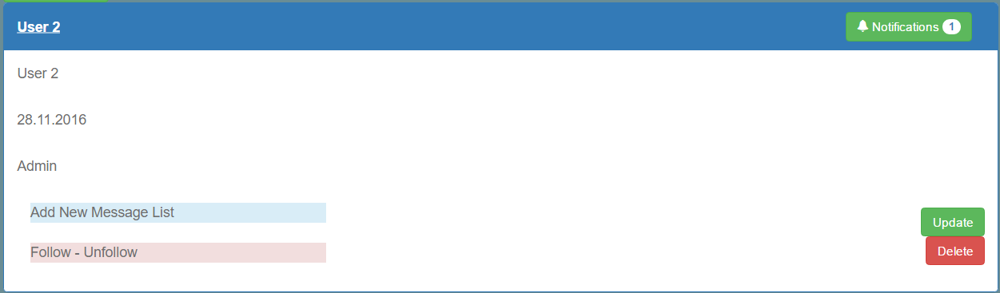

	The notifications of a user can be seen by clicking the "Notifications" button on the top right of the user's area. The numbers of the notifications that a user got is shown in that button.
	If the followed user adds, deletes or updates a Message List or a Message; a notification will be sent to the user that follows him for each operation.

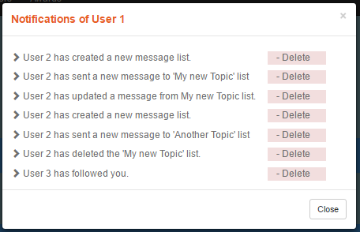

	When a "Notification" button is clicked, this windows pops.