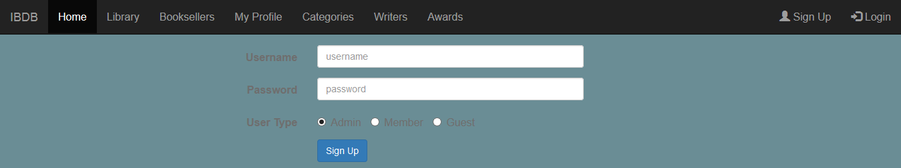
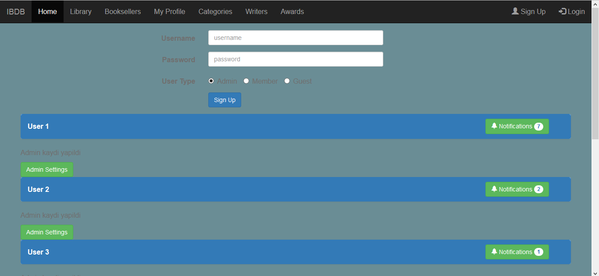
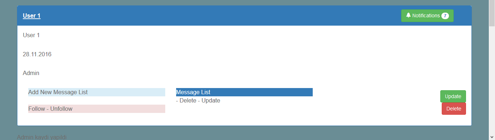
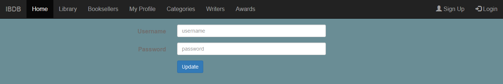
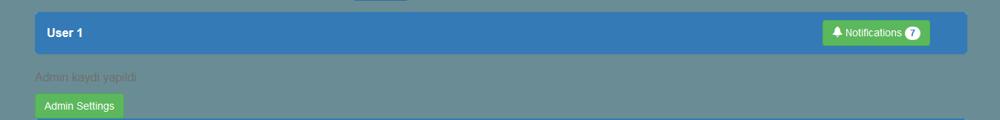
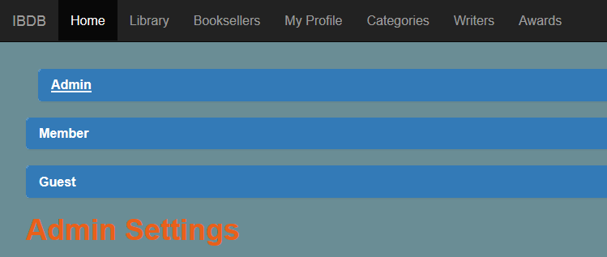
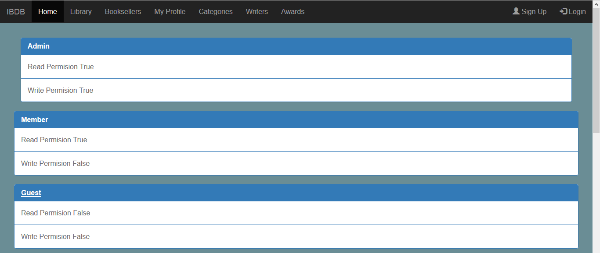
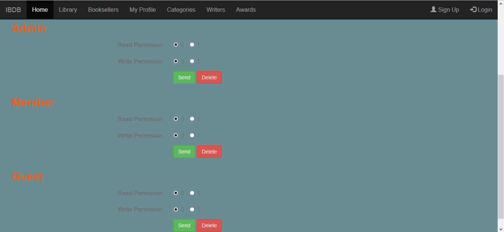

Parts Implemented by Mehmet Taha Çorbacıoğlu
============================================

Sign Up Page
------------

When user click Sign Up below page is opened. User can create new user by entering username and password. User can also select user type which are admin, member and guest.

User List
---------

In this page signed user is listed.

Below page shows their name, sign date and user type can be looked in list.

By clicking update button in user information send you to update page. User's username and password can be changed in there.

Admin Settings
--------------

If an admin is signed then below their information admin setting button is active.

But if member or guest is signed then they cannot access the admin settings.

In admin settings page, admin can see user types which are listed.

Admin can see which user type has rights to read and write.

If admin wants to change their permission below the page change and delete user type permissions.

