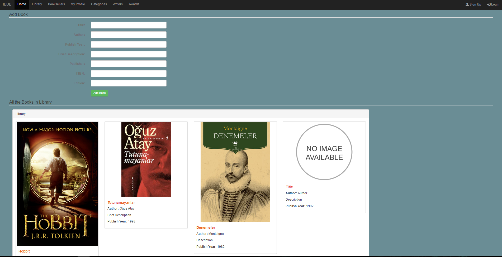
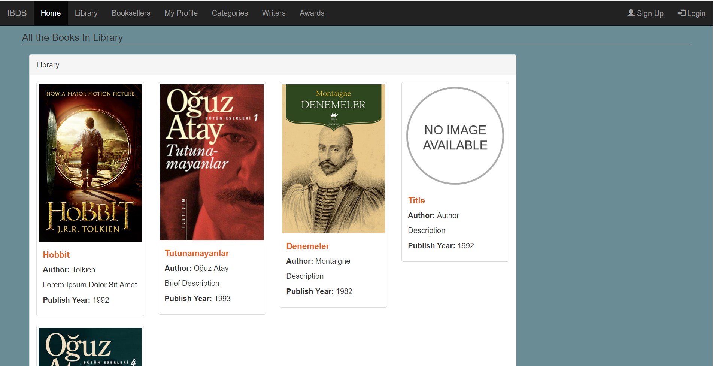
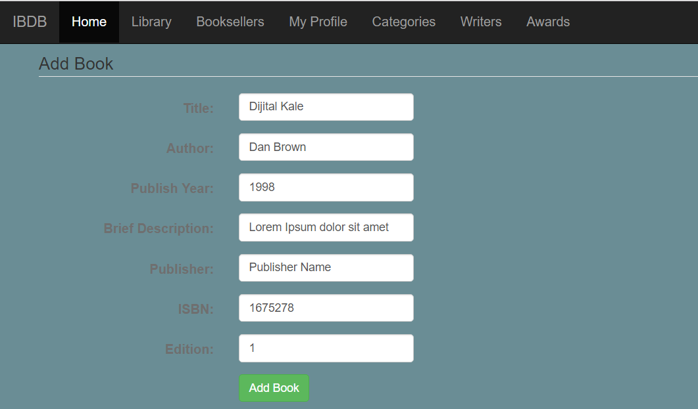
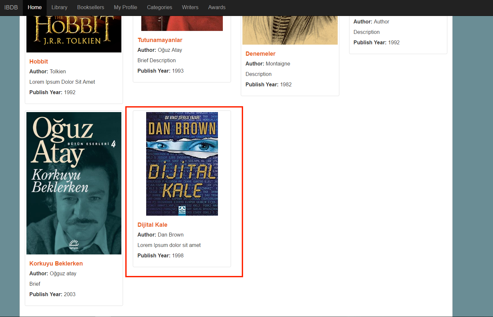
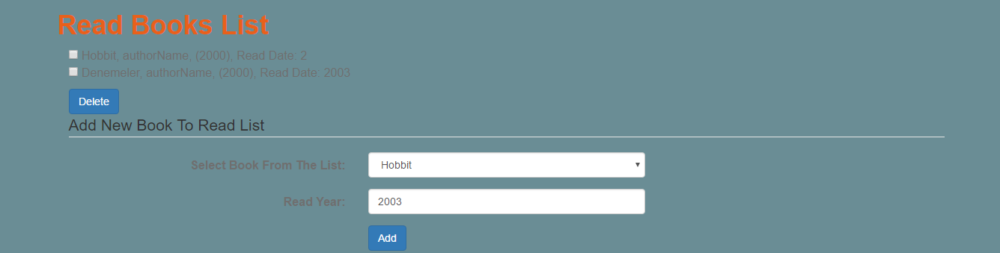
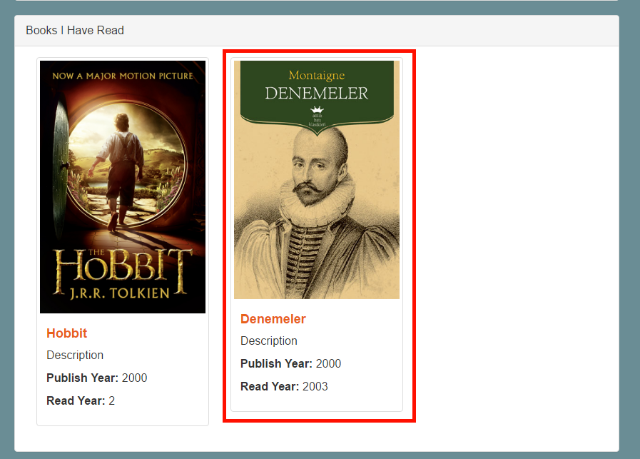

Parts Implemented by Tolga Şen
==============================

Library Page
------------

Here lies an example library page. In this part of the site, on the upper half of the page, user can enter the information about the book which will be added to the book database. Existing books are being display below that as represented here:

After entering the information about the book, user can easily add a new book to the library by clicking "Add Book" button:

Now the book is being displayed in the library part:

Profile Page
------------

As it can bee seen below, the user name, profile information, a little picture on the top right corner can be seen in the profile page. There is also the activity part which is displaying the information about the read books of the user and the other actions. The other part contains the books which have been read by this user. The read date and little information about the books are being written in the little boxes of the books.

Whenever user reads a book, he/she can add it to the list of his read books. By entering the information needed, and clicking "Add" button, the new read book is going to be displayed on the middle side of the page.

